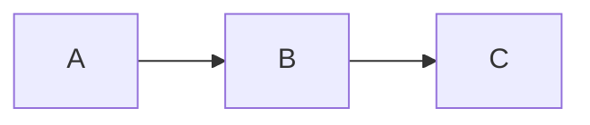

# Rivas

Rivas is a terminal Markdown viewer focused on rendering rich Markdown content
directly in Kitty-compatible terminals. It parses Markdown, renders terminal
text with Ratatui, and displays image-backed content through the Kitty graphics
protocol.

## Features

- Headings, paragraphs, block quotes, thematic breaks, and wrapped text.
- Inline emphasis, strong text, strikethrough, inline code, links, and inline math.
- Ordered, unordered, nested, and task lists.
- Tables with Markdown alignment markers.
- Local raster images.
- Mermaid diagrams rendered to PNG.
- LaTeX-style math rendered through MiTeX and Typst.
- Dark and light themes.

## Requirements

Rivas requires a terminal that supports the Kitty graphics protocol, such as:

- Kitty
- WezTerm
- Ghostty

If the terminal does not support the protocol, Rivas exits with an error instead
of falling back to a degraded image mode.

## Usage

View a file:

```sh
cargo run -- README.md
```

Read Markdown from stdin:

```sh
cat README.md | cargo run
```

Use the light theme:

```sh
cargo run -- --theme light README.md
```

Use the rendering fixture:

```sh
cargo run -- examples/all-rendering-cases.md
```

## Supported Markdown Notes

Math can be written inline with dollar delimiters:

```md
The quadratic formula is $x = \frac{-b \pm \sqrt{b^2 - 4ac}}{2a}$.
```

Display math can use `$$` blocks or fenced `math` blocks:

````md
$$
\int_0^\infty e^{-x} \, dx = 1
$$

```math
\Delta(Rivas) = \delta(rivas) \times \frac{2}{2}
```
````

Mermaid diagrams use fenced `mermaid` blocks:

````md

````

Local images are resolved relative to the Markdown file:

```md

```

## Development

Run the test suite:

```sh
cargo test
```

The math tests compile LaTeX-like input through MiTeX and Typst, rasterize the
resulting SVG to PNG, and verify that rendered output is not an all-white page.
