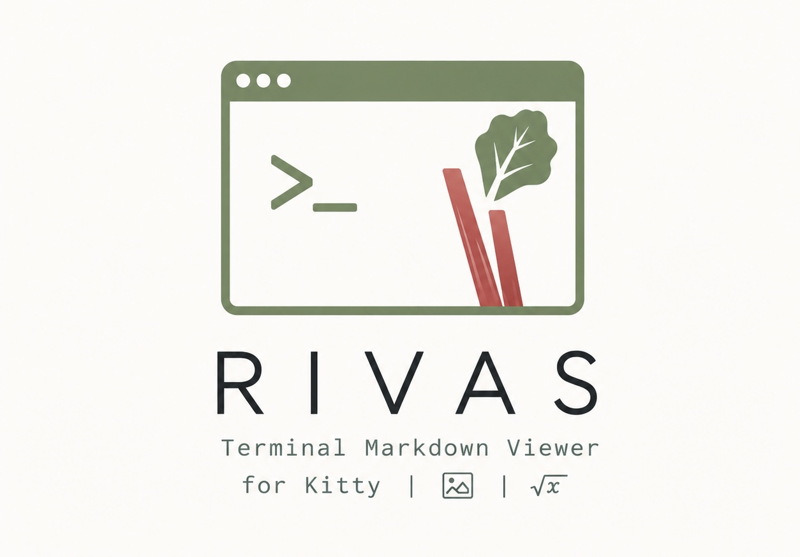
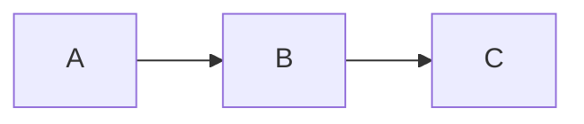

# Rivas

Rivas is a terminal Markdown viewer focused on rendering rich Markdown content
directly in Kitty-compatible terminals. It parses Markdown, renders terminal
text with iocraft, and displays image-backed content through the Kitty graphics
protocol.

## Features

- Headings, paragraphs, block quotes, thematic breaks, and wrapped text.
- Inline emphasis, strong text, strikethrough, inline code, links, and inline math.
- Ordered, unordered, nested, and task lists.
- Tables with Markdown alignment markers.
- Local raster images.
- Mermaid diagrams rendered to PNG.
- LaTeX-style math rendered through MiTeX and Typst.
- Vim-style source editing with a side-by-side live preview.
- Vim-style keyboard navigation in the rendered viewer.


## Requirements

Rivas requires a terminal that supports the Kitty graphics protocol, such as:

- Kitty
- WezTerm
- Ghostty

If the terminal does not support the protocol, Rivas exits with an error instead
of falling back to a degraded image mode.

## 🚀 Installation and Usage

### 🪟 Windows

1. Download the `rivas-x86_64-pc-windows-msvc.zip` from the Assets in releases.
2. Extract the `.exe` file to a folder of your choice.
3. (Optional) Add the folder to your **System PATH** to run `rivas` from any terminal.

Note: Only works with nightly WezTerm on windows (since other versions do not have full kitty support).

### 🍎 macOS

**Via Binary:**

1. Download `rivas-x86_64-apple-darwin.tar.gz` from assets in releases.
2. Extract the file: `rivas-x86_64-apple-darwin.tar.gz`.
3. Move it to your bin folder: `sudo mv rivas /usr/local/bin/`.
4. **Note:** If macOS blocks the app, go to *System Settings > Privacy & Security* and click "Allow Anyway."

### 🐧 Linux

```bash
# Download the binary
curl -LO https://github.com/hessikaveh/rivas/releases/download/v0.1.2/rivas-x86_64-unknown-linux-gnu.tar.gz

# Extract and install
tar -xzf rivas-x86_64-unknown-linux-gnu.tar.gz
sudo install -m 755 rivas /usr/local/bin/rivas
```

Then simply run:

```sh
rivas examples/all-rendering-cases.md
```

## Editing

Rivas can switch between rendered preview and side-by-side Markdown editing
without leaving the terminal UI.

Rendered viewer mode:

- `e`: enter side-by-side edit mode.
- `j` / `Down`: scroll down.
- `k` / `Up`: scroll up.
- `Ctrl-D`: scroll down by half a page.
- `Ctrl-U`: scroll up by half a page.
- `Ctrl-F`, `Space`, or `PageDown`: scroll down by one page.
- `Ctrl-B` or `PageUp`: scroll up by one page.
- `gg` / `Home`: jump to the top.
- `G` / `End`: jump to the bottom.
- `q` / `Esc`: quit.

Side-by-side edit mode:

- The source editor is on the left and the rendered preview is on the right.
- The preview is rebuilt as edits happen, including images, math, and Mermaid diagrams.
- The preview scrolls with the current source cursor line.
- `:view`, `:render`, or `:preview`: return to rendered viewer mode.
- `Esc`: leave insert, command, visual, or search mode inside the editor.
- `:q`: quit the editor if there are no unsaved changes.
- `:q!`: quit without saving.
- `:w`: save changes.
- `:wq` or `ZZ`: save and quit.

Editor normal mode supports Vim-style movement and editing, including `h/j/k/l`,
`w/b/e`, `0`, `^`, `$`, `gg`, `G`, `{`, `}`, `i`, `a`, `o`, `O`, `v`, `d`, `c`,
`y`, `p`, `P`, `u`, `Ctrl-R`, `/`, `?`, `n`, and `N`.

Saving writes to the opened file path. Markdown read from stdin can still be
edited during the session, but there is no durable destination unless you use a
file path.

## Supported Markdown Notes

Math can be written inline with dollar delimiters:

```md
The quadratic formula is $x = \frac{-b \pm \sqrt{b^2 - 4ac}}{2a}$.
```

Display math can use `$$` blocks or fenced `math` blocks:

````md
$$
\int_0^\infty e^{-x} \, dx = 1
$$

```math
\Delta(Rivas) = \delta(rivas) \times \frac{2}{2}
```
````

Mermaid diagrams use fenced `mermaid` blocks:

````md

````

Local images are resolved relative to the Markdown file:

```md

```

## Development

Run the test suite:

```sh
cargo test
```

The math tests compile LaTeX-like input through TyLax and Typst, rasterize the
resulting SVG to PNG, and verify that rendered output is not an all-white page.
