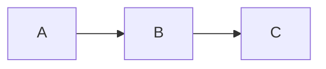

# Rivas

Rivas is a terminal Markdown viewer focused on rendering rich Markdown content
directly in Kitty-compatible terminals. It parses Markdown, renders terminal
text with Ratatui, and displays image-backed content through the Kitty graphics
protocol.

## Features

- Headings, paragraphs, block quotes, thematic breaks, and wrapped text.
- Inline emphasis, strong text, strikethrough, inline code, links, and inline math.
- Ordered, unordered, nested, and task lists.
- Tables with Markdown alignment markers.
- Local raster images.
- Mermaid diagrams rendered to PNG.
- LaTeX-style math rendered through MiTeX and Typst.
- Dark and light themes.

## Requirements

Rivas requires a terminal that supports the Kitty graphics protocol, such as:

- Kitty
- WezTerm
- Ghostty

If the terminal does not support the protocol, Rivas exits with an error instead
of falling back to a degraded image mode.

## Usage

View a file:

```sh
cargo run -- README.md
```

Read Markdown from stdin:

```sh
cat README.md | cargo run
```

Use the light theme:

```sh
cargo run -- --theme light README.md
```

Use the rendering fixture:

```sh
cargo run -- examples/all-rendering-cases.md
```

## Editing

Rivas can switch between rendered preview and Markdown source editing without
leaving the terminal UI.

Preview mode:

- `e` or `Enter`: edit the Markdown source in place.
- `s`: open side-by-side editing with source on the left and preview on the right.
- `j` / `Down`: scroll down.
- `k` / `Up`: scroll up.
- `Space` / `PageDown`: scroll down by one page.
- `PageUp`: scroll up by one page.
- `g` / `Home`: jump to the top.
- `G` / `End`: jump to the bottom.
- `q` / `Esc`: quit.

Edit modes:

- Rivas uses a small Vim-like normal/insert model.
- `i`: enter insert mode at the cursor.
- `a`: enter insert mode after the cursor.
- `o`: open a new line below and enter insert mode.
- `O`: open a new line above and enter insert mode.
- `Esc`: leave insert mode. Press `Esc` again from normal mode to return to preview.
- In insert mode, type normally to edit the document.
- In normal mode, `h`, `j`, `k`, and `l` move left, down, up, and right.
- Arrow keys, `Home`, `End`, `PageUp`, and `PageDown` also move the cursor.
- `gg`: jump to the top.
- `G`: jump to the bottom.
- `0`: move to the start of the line.
- `$`: move to the end of the line.
- `Ctrl-U` / `Ctrl-D`: move up or down by half a page.
- `x`: delete the character under the cursor.
- `dd`: delete the current line.
- `Tab`: insert four spaces in insert mode.
- `Ctrl-S`: save changes to the opened file.
- `F2`: switch to in-place editing.
- `F3`: switch to side-by-side editing.
- `Ctrl-Q`: quit without saving.

In side-by-side mode, the preview is rebuilt as edits happen and its scroll
position follows the source cursor.

Saving is only available when Rivas was opened with a file path. Markdown read
from stdin can still be edited during the session, but there is no destination
path to save to.

## Supported Markdown Notes

Math can be written inline with dollar delimiters:

```md
The quadratic formula is $x = \frac{-b \pm \sqrt{b^2 - 4ac}}{2a}$.
```

Display math can use `$$` blocks or fenced `math` blocks:

````md
$$
\int_0^\infty e^{-x} \, dx = 1
$$

```math
\Delta(Rivas) = \delta(rivas) \times \frac{2}{2}
```
````

Mermaid diagrams use fenced `mermaid` blocks:

````md

````

Local images are resolved relative to the Markdown file:

```md

```

## Development

Run the test suite:

```sh
cargo test
```

The math tests compile LaTeX-like input through TyLax and Typst, rasterize the
resulting SVG to PNG, and verify that rendered output is not an all-white page.
