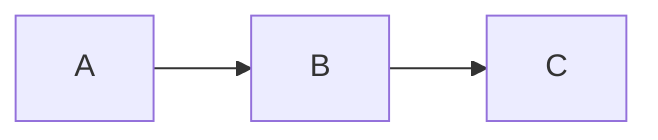

# Rivas

Rivas is a terminal Markdown viewer focused on rendering rich Markdown content
directly in Kitty-compatible terminals. It parses Markdown, renders terminal
text with iocraft, and displays image-backed content through the Kitty graphics
protocol.

## Features

- Headings, paragraphs, block quotes, thematic breaks, and wrapped text.
- Inline emphasis, strong text, strikethrough, inline code, links, and inline math.
- Ordered, unordered, nested, and task lists.
- Tables with Markdown alignment markers.
- Local raster images.
- Mermaid diagrams rendered to PNG.
- LaTeX-style math rendered through MiTeX and Typst.
- Vim-style source editing with a side-by-side live preview.
- Vim-style keyboard navigation in the rendered viewer.
- **CLI interface for AI agent integration** (new in v0.3.0).
- **Watch mode for collaborative editing** (new in v0.3.0).


## Requirements

Rivas requires a terminal that supports the Kitty graphics protocol, such as:

- Kitty
- WezTerm
- Ghostty

If the terminal does not support the protocol, Rivas exits with an error instead
of falling back to a degraded image mode.

## 🚀 Installation and Usage

### 🪟 Windows

1. Download the `rivas-x86_64-pc-windows-msvc.zip` from the Assets in releases.
2. Extract the `.exe` file to a folder of your choice.
3. (Optional) Add the folder to your **System PATH** to run `rivas` from any terminal.

Note: Only works with nightly WezTerm on windows (since other versions do not have full kitty support).

### 🍎 macOS

**Via Binary:**

1. Download `rivas-x86_64-apple-darwin.tar.gz` from assets in releases.
2. Extract the file: `rivas-x86_64-apple-darwin.tar.gz`.
3. Move it to your bin folder: `sudo mv rivas /usr/local/bin/`.
4. **Note:** If macOS blocks the app, go to *System Settings > Privacy & Security* and click "Allow Anyway."

### 🐧 Linux

```bash
# Download the binary
curl -LO https://github.com/hessikaveh/rivas/releases/download/v0.2.7/rivas-x86_64-unknown-linux-gnu.tar.gz

# Extract and install
tar -xzf rivas-x86_64-unknown-linux-gnu.tar.gz
sudo install -m 755 rivas /usr/local/bin/rivas
```

Then simply run:

```sh
rivas examples/all-rendering-cases.md
```

## Editing

Rivas supports edit in place with neovim style editting and key shortcuts.

## CLI Interface (New in v0.3.0)

Rivas now includes a CLI interface for AI agent integration, enabling collaborative editing where humans work in the TUI while agents send commands via CLI.

### Watch Mode

Start Rivas in watch mode to enable CLI interaction:

```bash
rivas --watch document.md
```

This creates a Unix socket at `/tmp/rivas-{hash}.sock` for CLI communication.

### CLI Client

Use the `rivas-cli` binary to send vim commands:

```bash
# Execute a vim command
rivas-cli exec "10G"      # Go to line 10
rivas-cli exec "dd"       # Delete current line
rivas-cli exec ":w"       # Save file

# Execute multiple commands
rivas-cli exec-many "10G" "dd" ":w"

# Query editor state
rivas-cli query cursor    # Get cursor position
rivas-cli query content   # Get file content
rivas-cli query status    # Get full status

# JSON output for parsing
rivas-cli --format json exec "dd"
rivas-cli --format json query status
```

### Supported Vim Commands

**Motions:** `h`, `l`, `j`, `k`, `w`, `b`, `e`, `0`, `^`, `$`, `G`, `gg`, `{`, `}`

**Operators:** `dd`, `yy`, `x`, `p`, `P`, `J`, `~`, `r{char}`

**Mode Changes:** `i`, `a`, `I`, `A`, `o`, `O`

**Search:** `/pattern`, `?pattern`, `n`, `N`

**Commands:** `:w`, `:q`, `:wq`, `:q!`

**Counts:** Prefix any motion or operator: `3j`, `5dd`, `10G`

### Example: Agent Collaboration

```bash
# Terminal 1: Human opens Rivas in watch mode
rivas --watch document.md

# Terminal 2: Agent makes edits
rivas-cli exec "Go## New Section"    # Add heading at end
rivas-cli exec "o- Item 1"          # Add list item
rivas-cli exec "- Item 2"           # Add another item
rivas-cli exec ":w"                 # Save changes

# Agent checks result
rivas-cli query status
```

### JSON Protocol

**Request:**
```json
{
  "id": "cmd-123",
  "command": "dd",
  "args": []
}
```

**Response:**
```json
{
  "id": "cmd-123",
  "success": true,
  "message": "1 line deleted",
  "cursor": {"row": 9, "col": 0},
  "modified": true
}
```

## Supported Markdown Notes

Math can be written inline with dollar delimiters:

```md
The quadratic formula is $x = \frac{-b \pm \sqrt{b^2 - 4ac}}{2a}$.
```

Display math can use `$$` blocks or fenced `math` blocks:

````md
$$
\int_0^\infty e^{-x} \, dx = 1
$$

```math
\Delta(Rivas) = \delta(rivas) \times \frac{2}{2}
```
````

Mermaid diagrams use fenced `mermaid` blocks:

````md

````

Local images are resolved relative to the Markdown file:

```md

```

## Development

Run the test suite:

```sh
cargo test
```

The math tests compile LaTeX-like input through TyLax and Typst, rasterize the
resulting SVG to PNG, and verify that rendered output is not an all-white page.

### Building from Source

```sh
# Build the main binary
cargo build --release

# Build the CLI client
cargo build --bin rivas-cli --release

# Run tests
cargo test
```

### Project Structure

```
src/
  main.rs                 # Main TUI application
  lib.rs                  # Library exports (Editor API)
  bin/
    rivas-cli.rs          # CLI client binary
  editor/                 # Core editor logic (library)
    buffer.rs             # Text buffer implementation
    state.rs              # Editor state management
    action.rs             # Vim actions and motions
    position.rs           # Cursor position types
  protocol/               # JSON protocol for CLI
    types.rs              # Request/response types
    socket.rs             # Unix socket communication
  components/             # TUI components (iocraft)
    editor.rs             # Key handling for TUI
    document.rs           # Document rendering
    ...
```
