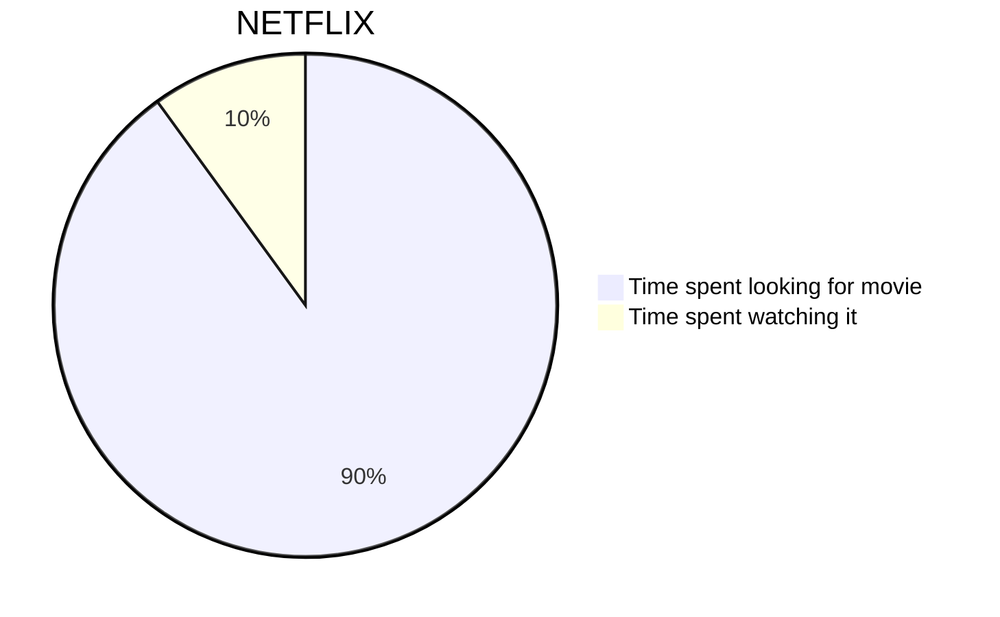

# RIVAS ☺️

A markdown view and edit tool for the command line. ☺️
> TODO
> Need to pay attention to the line text wrapping.

``` Python
def main():
  print("Hello")
```

- first
- second
- [ ] third
- [x] fourth

1. first
    - one
1. second
    - two
      - two

| Item              | In Stock | Price |
| :---------------- | :------: | ----: |
| Python Hat        |   True   | 23.99 |
| SQL Hat           |   True   | 23.99 |
| Codecademy Tee    |  False   | 19.99 |
| Codecademy Hoodie |  False   | 42.99 |

| Month    | Savings |
| -------- | ------- |
| January  | $250    |
| February | $80     |
| March    | $420    |



