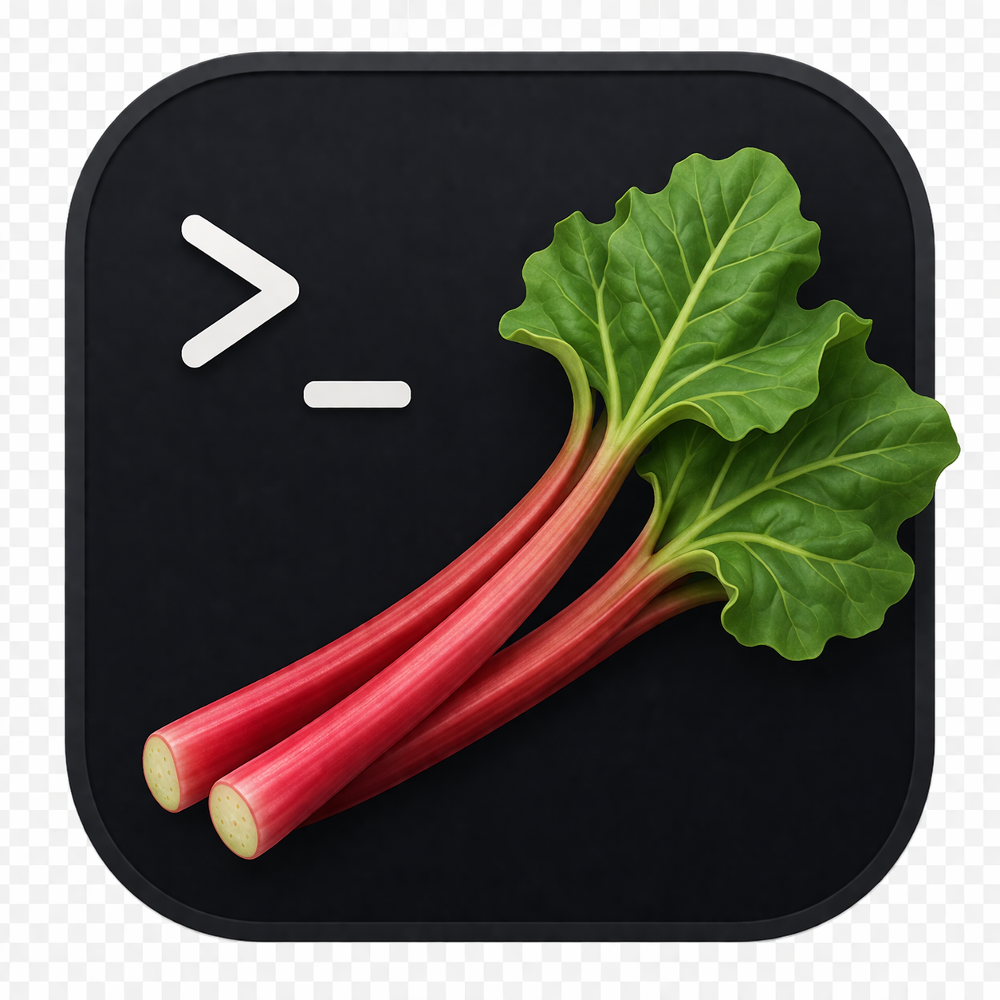
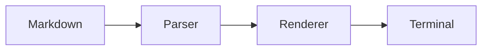
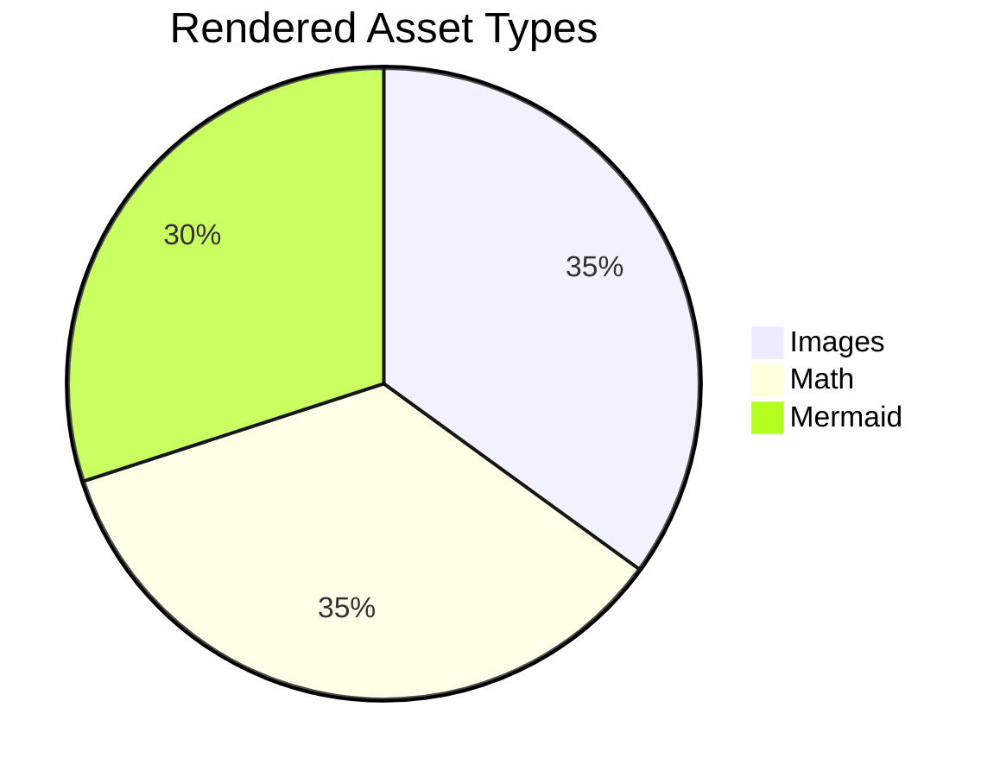
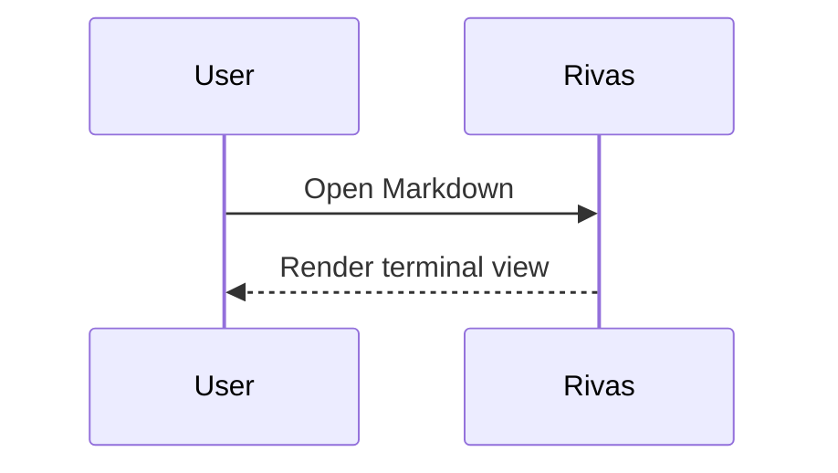

# Rivas Rendering Cases 🌱

This file is a rendering fixture for the Markdown objects Rivas supports.

## Paragraphs And Inline Text

Plain text should wrap naturally across terminal columns. This paragraph includes
soft line breaks in the source that should remain part of the same paragraph
unless Markdown requires a hard break.

This paragraph contains **strong text**, *emphasis*, ~~strikethrough~~,
`inline code`, a [link to the Rust website](https://www.rust-lang.org/), and
inline math $E = mc^2$.

Hard break after this line.  
This line should appear below it.

## Headings

# Heading 1

## Heading 2

### Heading 3

#### Heading 4

##### Heading 5

###### Heading 6

## Block Quote

> Rivas should render quoted text with quote styling.
>
> Quotes can contain **inline formatting** and `inline code` $x^2$.

# Remote Gif

## Lists

- Unordered item $\int_0^\infty$
- Unordered item with nested content
  - Nested item
  - Nested item with $x^2 + y^2 = z^2$
- Final unordered item

1. Ordered item $E = mc^2$
2. Ordered item with nested content
   1. Nested ordered item
   2. Another nested ordered item
3. Final ordered item

- [x] Completed task
- [ ] Open task
- [x] Task with **formatting**

## Code Blocks

```rust
fn main() {
    println!("Hello from Rivas");
}
```

```python
def fibonacci(n: int) -> list[int]:
    values = [0, 1]
    while len(values) < n:
        values.append(values[-1] + values[-2])
    return values[:n]

# Some comments
def some_func(d: int, e: int):
    """ This function does sth """
    a = {'b': 'c'}
    # Why b and not d
    f = d * e
    print(a['b'])
```

## Tables

| Item | Status | Count |
| :--- | :----: | ----: |
| Text | Ready | 12 |
| Image | Ready | 1 |
| Math | Ready | 3 |
| Mermaid | Ready | 2 |

| Month | Savings |
| --- | ---: |
| January | $250 |
| February | $80 |
| March | $420 |

## Thematic Break

Before the rule.

---

After the rule.

## Local Image




## Remote Image


## SVG Image


## Mermaid





## Math

Inline math should render in text flow: $x = \frac{-b \pm \sqrt{b^2 - 4ac}}{2a}$.

A vector norm: $\|x\|_2 = \sqrt{x_1^2 + x_2^2}$.

$$
\int_0^\infty e^{-x} \, dx = 1
$$

$$
I =
\begin{bmatrix}
1 & 0 & 0 \\
0 & 34 & 0 \\
0 & 0 & x^2
\end{bmatrix}
$$

```math
\Delta(Rivas) = \delta(rivas) \times \frac{Rivas * 2}{2}
```

## Mixed Content

1. Render text first.
2. Render inline math $a^2 + b^2 = c^2$.
3. Render a diagram:



4. Render a final image:


